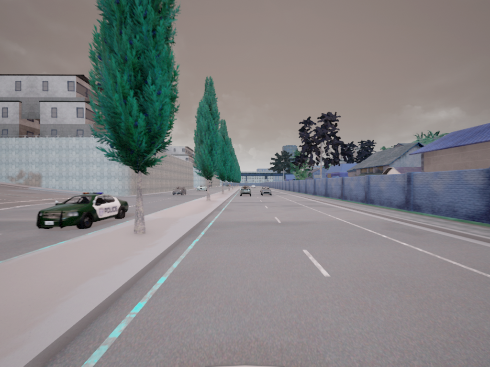

# Carla-synthetic-dataset-generation
Creating synthetic dataset for training the 3D bbox module.

Backbone from https://github.com/AlanNaoto/carla-dataset-runner

# Setup prerequisites

* Step1: 
  Python carla package and its dependencies.
  Follow this guide to install Carla via github.
  
 ```
  https://carla.readthedocs.io/en/latest/start_quickstart/
 ```
* Step2: 
  Clone this repo.
  For other dependencies (to run data capturing scripts)
  
 ```
  pip install -r requirements.txt
 ```

* Step3:
  Setup the python path for the carla egg file.
  Open the [settings.py](settings.py) file and change the carla egg path to your own.

# Running

* step1: Launch CarlaEU4
  Navigate to the folder where carla's pre-compiled package is present: 
```
  ./CarlaUE4.sh TownXX -opengl 
```
* step2: Launch data capturing

  Navigate to the folder where the repo is cloned: 
```
  python3 main.py -ve 100 -wa 110 
```

# Data captured

  Illustration of the data captured in a newly created 'Data' folder.
  
  Parameters :
```
  Type,BBox,Dimensions,Rotation_Y_(Red_Theta),Alpha_(Blue_Theta),Center_(ground_projection) 
  
  car,[ 96 364 246 464],"[5.19923, 2.61502, 2.47685]",-200.03459930419922,-108.02967071533203,"['6.315044', '-25.302868', '-0.001832']"
  car,[647 383 696 403],"[3.718622, 1.792448, 1.535494]",-91.14862298965454,0.8563055992126465,"['86.270348', '4.308983', '-0.010692']"
  pedestrian,[827 402 846 433],"[0.68, 0.68, 1.3]",87.95936584472656,179.96429443359375,"['65.018478', '-144.177292', '8.336428']"
  pedestrian,[825 383 837 403],"[0.68, 0.68, 1.86]",9.286087036132812,101.291015625,"['223.223145', '133.068954', '2.079820']"

```
   Image : 
   
   


