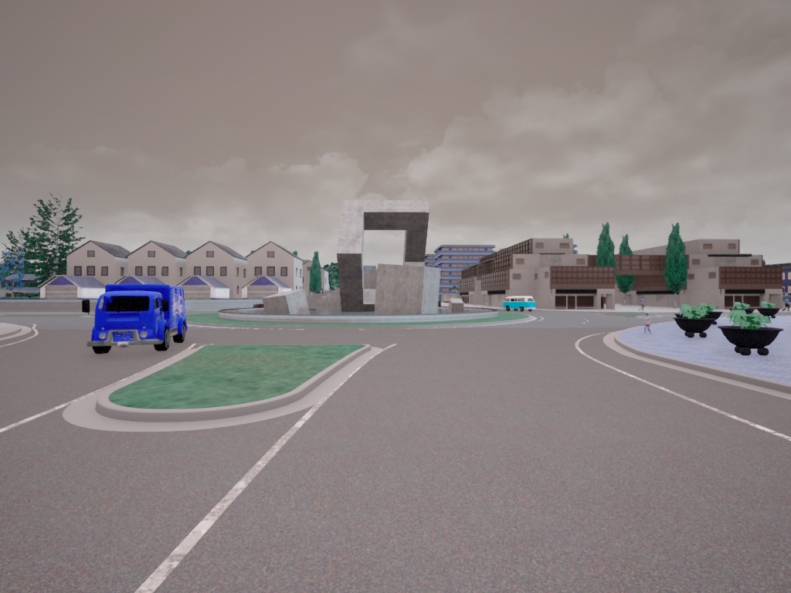

# Carla-synthetic-dataset-generation
Creating synthetic dataset for training 3D bbox module

Inspired from https://github.com/AlanNaoto/carla-dataset-runner

# Setup prerequisites

* Step1: 
  Python carla package and its dependencies.
  Follow this guide to install Carla via github.
  https://carla.readthedocs.io/en/latest/start_quickstart/

* Step2: 
  Clone this repo.
  For other dependencies (to run data capturing scripts), use the requirements.txt 

* Step3:
  Setup the python path for the carla egg file.
  Open the [settings.py](settings.py) file and change the carla egg path to your own.

# Running

* step1: Launch CarlaEU4
  Navigate to the folder where carla pre compiled package is present, open a terminal and: 
```
  ./CarlaUE4.sh TownXX -opengl 
```
* step2: Launch data capturing

  Navigate to the folder where the repo is cloned, open a terminal and: 
```
  python3 main.py -ve 100 -wa 110 
```

# Data captured
  Images (RGB) and .txt files with following parameters are captured in 'Data' folder.
  
  Parameters captured in .txt file (Example):
```
  Type,BBox,Dimensions,Rotation_Y_(Red_Theta),Alpha_(Blue_Theta),Center_(ground_projection) 
  
  car,[357 389 391 409],"[4.220494, 2.00914, 1.390608]",96.92396485805511,97.6175765991211,"['-7.321383', '-31.294941', '-0.004224']"
  car,[542 390 568 408],"[5.369194, 2.052736, 1.4151]",-2.0031819343566895,-1.3095701932907104,"['-56.831127', '135.252884', '-0.047932']"
  car,[500 389 526 409],"[3.975348, 1.862074, 1.625772]",0.5150392055511475,1.2086509466171265,"['-22.965351', '-135.263336', '0.038711']"
  car,[409 387 432 400],"[3.868106, 1.90657, 1.88]",-89.38922941684723,-88.69561767578125,"['-74.229744', '67.062477', '0.837984']"
  car,[ 45 399 275 487],"[4.904702, 2.060658, 1.478398]",-180.6326071023941,-179.93899536132812,"['49.539810', '-7.808246', '-0.004740']"

```
   Image captured: 
   
   


